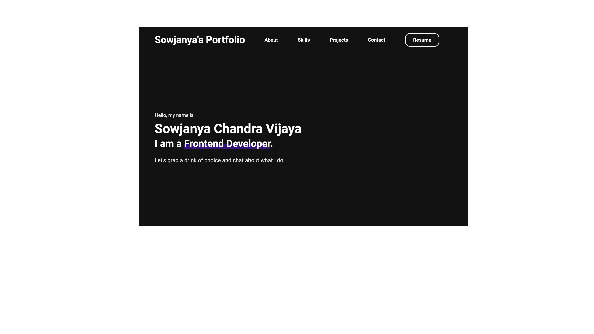
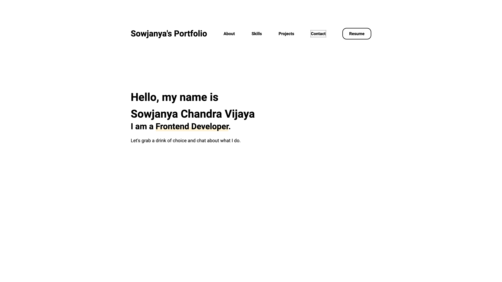

# Sowjanya's Portfolio

This portfolio website is created with Gatsby. The light or dark theme is not trigerable. It's based on your browser's current theme.

---

## Installation of Gatsby Starter Portfolio Minimal Theme

1. Install the Gatsby CLI

   ```sh
   npm install -g gatsby-cli
   ```

2. Create a new Gatsby site with the Portfolio Minimal Starter.

   ```sh
   gatsby new portfolio-minimal https://github.com/konstantinmuenster/gatsby-starter-portfolio-minimal-theme
   ```

3. Once installed, you can begin developing your site.

   ```sh
   cd portfolio-minimal
   gatsby develop
   ```

4. By default, the Portfolio Minimal Starter has a `content` directory at the root of your Gatsby site. There, you can edit the theme settings as well as add content for your sections. To learn more about it, have a look at the [Readme of Portfolio Minimal](https://github.com/konstantinmuenster/gatsby-theme-portfolio-minimal/tree/main/gatsby-theme-portfolio-minimal#readme).
